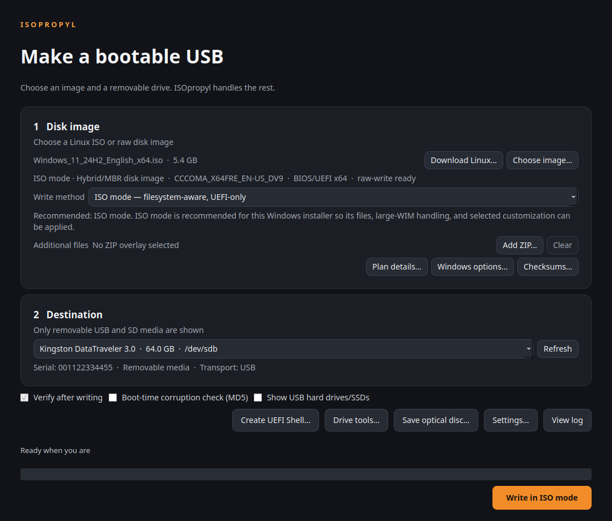

<div align="center">


[](https://github.com/codebooker/isopropyl/actions/workflows/test.yml)
[](LICENSE)
[](#requirements)
[](#project-status)

**A capable, safety-first USB image writer for Linux.**

[Features](#features) · [Install](#installation) · [ISO mode](#iso-mode) · [Safety](#safety-model) · [Roadmap](ROADMAP.md)

<sub>RAW DD &nbsp;•&nbsp; UEFI ISO MODE &nbsp;•&nbsp; WINDOWS CUSTOMIZATION &nbsp;•&nbsp; READ-BACK VERIFICATION</sub>

</div>



<p align="center"><sub>Inspect the image, choose an explicit write method, and verify the exact removable target before anything is erased.</sub></p>

ISOpropyl creates bootable USB and SD media without asking you to surrender a
whole graphical application to root. It combines straightforward DD writing
with a filesystem-aware UEFI ISO workflow, deep image inspection, Windows
installer customization, verification, backups, formatting, and media tools.

> [!WARNING]
> ISOpropyl is alpha software that can overwrite entire drives. Read the target
> model, capacity, path, and serial number before confirming any destructive
> operation. Keep backups of anything important.

## Features

### Write more than raw images

- A first-class **ISO vs DD selector** recommends the safest compatible method
  from the inspected image, explains why, and never silently changes your choice.
- **DD mode** for hybrid ISOs and raw disk images, with cancellation and
  byte-for-byte read-back verification.
- **ISO mode** for supported UEFI media: safely extract the ISO, choose FAT32
  or NTFS automatically, split an oversized Windows `install.wim` when useful,
  optionally add `autounattend.xml`, and SHA-256 verify every copied file from
  the USB. Large-file NTFS media use an exact, read-back-verified UEFI:NTFS
  bridge obtained from a version-and-hash-pinned upstream artifact.
- Stream `.gz`, `.gzip`, `.bz2`, `.bzip2`, `.xz`, `.lzma`, `.zst`, `.zstd`,
  legacy `.Z`, and single-file ZIP images without creating an expanded copy.
- Inspect and convert VHD, VHDX, QCOW, and QCOW2 containers through a bounded,
  identity-checked `qemu-img` staging step—container headers are never written
  as if they were disk sectors.

### Understand an image before writing it

- Detect raw, MBR/hybrid, GPT, ISO 9660, BIOS, and UEFI layouts.
- Parse El Torito boot catalogs and report their BIOS/UEFI boot entries.
- Inspect removable-media EFI executables, PE architecture, certificate-table
  presence, and SBAT structure without pretending that structure equals trust.
- Detect Windows installer media and exact GRUB/Syslinux payload identities when
  the image contains enough evidence.
- Calculate MD5, SHA-1, SHA-256, and SHA-512 in one pass and compare a provider's
  pasted checksum without guessing.

### Customize Windows installation media

ISOpropyl inspects `install.wim` and `install.esd`, shows each edition, index,
architecture, version, and build, and can bind Windows Setup to the selected
image—or leave the choice to Setup. It can also generate and apply a transparent
Windows answer file with options for:

- Windows 11 RAM, TPM 2.0, and Secure Boot setup-check bypasses;
- local administrator creation and Microsoft-account screen suppression;
- privacy/OOBE choices and automatic BitLocker-device-encryption prevention;
- input locale, system/UI language, user locale, keyboard layout, and time zone.

The XML is inspectable and exportable. Existing root or OEM/Panther Windows
answer files are detected case-insensitively and never silently combined or
replaced.

Local-account creation deliberately embeds no secret: the administrator starts
with a blank password, and one sequential first-logon command requests an
immediate password replacement and applies the selected expiration policy.
That command is a Windows Setup policy, not a security guarantee; it does not
run in Windows S mode and can be affected by setup policy or command failure.
ISOpropyl warns before enabling this option, and S-mode media should not use it.

### Maintain and validate removable media

- Save a complete removable drive as an atomic raw image backup.
- Capture readable optical media to ISO without modifying the disc.
- Restore a drive as FAT32, exFAT, NTFS, ext2, ext3, or ext4 using MBR or GPT.
- Run destructive bad-block passes and F3 fake-capacity probes as separate,
  heavily warned workflows.
- Zero the full device or only its boundary metadata regions.
- Export privacy-conscious diagnostics and a rotating local activity log.

## Safety model

Destructive disk software deserves boring, explicit safeguards. ISOpropyl:

- excludes the disk backing the running root filesystem;
- shows removable USB/SD media only, hiding USB hard drives and SSDs unless you
  explicitly reveal them;
- operates only on validated whole-device paths beneath `/dev`;
- binds the selected model, capacity, serial/WWN, transport, and major:minor
  identity, then rechecks them around unmounting and immediately before writes;
- refuses an image or staging tree stored on the destination drive;
- runs privileged tools with fixed argument arrays—never constructed shell text;
- wraps privileged destructive tools in fail-fast, whole-device cooperative
  locks that coordinate with systemd-udevd and other lock-aware storage tools;
- time-bounds short-lived privileged-command wrappers and uses bounded
  terminate/kill/reap handling when cancelling long-running destructive tools;
- will not overwrite backup, optical-capture, extraction, or staging outputs;
- keeps drive erasure and destructive media testing outside the normal write
  button, with separate confirmations.

See [SECURITY.md](SECURITY.md) for the reporting policy and security invariants.

## Supported inputs

| Input | Current path | Notes |
|---|---|---|
| Hybrid `.iso` | DD mode | Preserves the image's existing disk layout. |
| UEFI `.iso` | ISO mode | GPT/FAT32 when every file fits; GPT/NTFS plus a pinned UEFI:NTFS bridge for x64, x86, ARM64, and explicitly consented unsigned ARM32/RISC-V64 large-file media. |
| `.img`, `.raw`, `.usb`, `.wic`, and raw disk images | DD mode | Exact image bytes are written. `.usb` and Yocto-style `.wic` files are treated as raw disk images, not structured installers. |
| Compressed raw images | Streaming DD | Formats listed above; ZIP must contain exactly one regular image. |
| VHD/VHDX/QCOW/QCOW2 | Convert, then DD | Requires `qemu-img`; backing files and encrypted containers are rejected. |

Unsupported formats fail closed instead of being guessed. FFU, VTSI, Windows To
Go, dual BIOS+UEFI construction, broader persistence profiles, and broader
architecture/firmware profiles are tracked in the
[feature audit](FEATURE_MATRIX.md).

## Requirements

- Linux with Python 3.10 or newer and PyQt 6.5 or newer.
- `lsblk`, `findmnt`, `udisksctl`, `pkexec`, GNU `dd`, and util-linux `flock`
  for normal device work.
- 7-Zip (`7z`) for ISO cataloging and safe extraction.
- `sfdisk` and `mkfs.vfat` for FAT32 ISO mode; `mkfs.ntfs` (usually supplied by
  `ntfs-3g`) for large-file UEFI:NTFS media.
- `wimlib-imagex` (commonly packaged as `wimtools`) to inspect or select Windows
  WIM/ESD editions, and to split `sources/install.wim` when it exceeds FAT32's
  per-file limit.

Optional tools unlock additional workflows:

| Capability | Tool |
|---|---|
| VHD/VHDX/QCOW/QCOW2 | `qemu-img` |
| NTFS ISO mode and NTFS/exFAT/ext2/ext3/ext4 restore | `mkfs.ntfs`, `mkfs.exfat`, `mkfs.ext2`, `mkfs.ext3`, `mkfs.ext4` |
| Experimental matched Ubuntu persistence profile | `mkfs.ext4` |
| Surface and fake-capacity tests | `badblocks`, `f3probe` |
| Additional ISO inspection | `xorriso` |
| Zstandard-compressed images | Python `zstandard` module or `zstd` |
| Legacy Unix `.Z` images | `gzip` |

ISO mode needs temporary free space for the extracted tree. Splitting a large
WIM conservatively requires room for the extracted WIM and its split parts at
the same time; ISOpropyl calculates and displays the requirement before starting.
Edition inspection also extracts the complete WIM/ESD member into private
temporary storage and can therefore require several gigabytes.

## Installation

### Run from source

```bash
git clone https://github.com/codebooker/isopropyl.git
cd isopropyl
python3 -m venv .venv
. .venv/bin/activate
python -m pip install --upgrade pip
python -m pip install -e .
isopropyl
```

You can also launch the working tree directly:

```bash
./isopropyl-gui
./isopropyl-gui path/to/image.iso
```

Install required host tools through your distribution's package manager. On
Debian/Ubuntu-family systems, the relevant package names commonly include
`p7zip-full`, `udisks2`, `util-linux`, `fdisk`, `dosfstools`, `e2fsprogs`,
`ntfs-3g`, `wimtools`, and `qemu-utils`.

The first UEFI:NTFS use asks permission to download a 1 MiB helper from its
release-pinned Rufus source URL. ISOpropyl verifies the exact byte count and
SHA-256 before it can reach a destructive operation, caches it locally, and
revalidates the cache on every use. **Settings → Manage downloaded boot
helpers…** inventories catalog-known cache entries and can remove filesystem-safe
regular files—including corrupt or incomplete copies. Unknown paths, links,
hard-linked files, and entries that change during inspection are deliberately
left untouched.

> [!IMPORTANT]
> Run ISOpropyl as your normal desktop user. It requests narrowly scoped
> elevation through `pkexec` only when a block-device operation begins.

## Usage

### DD mode

1. Choose or drop an image.
2. Select the removable destination and review its identity.
3. Choose **DD mode — exact byte-for-byte copy** in the visible method selector.
4. Leave **Verify after writing** enabled, select **Write in DD mode**, review
   the final erase warning, and confirm.

### ISO mode

1. Select an ISO and a destination drive.
2. Choose **ISO mode — filesystem-aware, UEFI-only**. ISOpropyl shows why it
   recommends ISO or DD mode and never switches methods silently.
3. Optionally open **Plan details…**, then select **Write in ISO mode** and
   choose a disk with enough temporary working space.
4. Review the exact filesystem, firmware limitation, transformations, target
   path, and serial number, then confirm.

An experimental **Persistent storage** control exists only for candidate
remastered Ubuntu amd64 images whose catalog exposes a recognized UEFI GRUB
config path and legacy Casper file layout. Private staging then validates that
the file really contains an eligible kernel line before any target change.
Current official Ubuntu 20.04.6, 22.04.5, and 24.04.3 desktop catalogs do not
meet even the candidate gate, so ISOpropyl deliberately hides the option for
them instead of producing media that only appears persistent.

For supported Windows media, configure **Windows options…** before starting ISO
mode. You can choose a specific WIM/ESD edition or let Windows Setup ask. Windows
customization is applied only in ISO mode; choosing DD mode produces an explicit
warning instead of silently discarding the profile.

Keyboard shortcuts: <kbd>Ctrl</kbd>+<kbd>O</kbd> opens an image,
<kbd>Ctrl</kbd>+<kbd>R</kbd> refreshes targets,
<kbd>Ctrl</kbd>+<kbd>L</kbd> opens the log, and <kbd>Esc</kbd> cancels.

## Development

```bash
python3 -m unittest discover -s tests -v
python3 -m compileall -q isopropyl tests
desktop-file-validate data/io.github.codebooker.isopropyl.desktop
appstreamcli validate --no-net data/io.github.codebooker.isopropyl.metainfo.xml
```

The suite currently contains more than 450 tests. Device-facing tests mock block
devices and privileged commands; the automated suite never writes a real drive.
See [CONTRIBUTING.md](CONTRIBUTING.md) before proposing changes to a destructive
path.

## Project status

ISOpropyl is an ambitious alpha, not yet a feature-for-feature Rufus replacement.
The FAT32 and UEFI:NTFS ISO paths are real but have only mocked block-device
coverage; they still need broad distro, firmware, Secure Boot, card-reader, and
physical-media testing. Persistence has a hardened layout backend and guarded
GUI plumbing, but current official Ubuntu images need embedded UEFI GRUB-config
support before the option can be offered. BIOS/dual-firmware construction,
broader persistence profiles, Windows To Go, broader verified-download catalogs,
localization, and release packaging remain active work.

The detailed, evidence-based status lives in [FEATURE_MATRIX.md](FEATURE_MATRIX.md)
and [ROADMAP.md](ROADMAP.md).

## Inspiration and license

ISOpropyl is inspired by the clarity and capability of
[Rufus](https://github.com/pbatard/rufus). Its application code is an independent
Linux-native implementation. The optional UEFI:NTFS runtime helper is an
unmodified, hash-pinned upstream artifact with separate licensing documented in
[THIRD_PARTY_NOTICES.md](THIRD_PARTY_NOTICES.md).

The official symbol, repository banner, palette, and naming guidance live in
[BRANDING.md](BRANDING.md).

Copyright is held by ISOpropyl contributors. The project is free software under
the [GNU Affero General Public License v3.0 or later](LICENSE).
